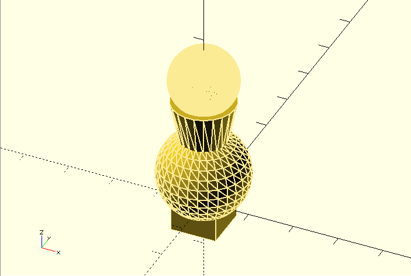

# Digital fabrication

2017 3D講義スライド

松浦知也

---

## 今回の最終目標

- 2Dの時:イラレなどでは作りにくい図形をプログラミングで作る
- 今回:**普通の3Dモデリングでは作りにくい3Dオブジェクトを作る**

---

## 3Dのデータ構造

|データの種類|内容|
|---|----|
|ポイントクラウド|点の集まり|
|ワイヤーフレーム|ポイントクラウド+頂点同士のつながり|
|サーフェス|ワイヤーフレーム+どこに面が張られているか|
|ソリッド|サーフェース+どこの面で閉じた空間が充填されているか|

- 最終的に体積を持っていないと3Dプリンタなどで出力できない

---

## 3D+プログラミング

- これらのデータを直に扱うのも不可能ではないが、大変
- そこでProcessingの時と同様、**単純な3Dオブジェクトを組み合わせる**
- 加えて3Dでは、**単純な2D図形を押し出して3Dにする**事もできる

---

## 単純図形の組み合わせ


---

### 押し出し


---


## 作例


---

## 今回使うソフト：OpenSCAD

<http://www.openscad.org/>

- プログラミング＋3DモデリングだとRhinoceros用のGrasshopperがよく使われるが、Rhinocerosは有償
- 今回は3Dの形状を作るところまでで良いので、OpenSCADでも十分

---


---

## サンプル1

```java
//tutorial1.scad
//Processing同様スラッシュ*2以降はコメントアウト（無効）

// 真ん中に箱を置く
cube(10); //単位はmm
```

---

### 結果


---

```java
// 真ん中に箱を置く
cube(10); //単位はmm

//移動させる
translate([30,20,0]){//中括弧は省略できるが見にくくなる
    //幅、奥行き、高さを別々にする、中心に配置する
    cube([10,20,30],center=true);
}

//移動してから軸の周りに回転させる。
rotate([40,45,70]){
    translate([30,20,0]){
     cube([10,20,30],center=true);   
    }
}

//回転してから平行移動させる
translate([30,20,0]){
    rotate([40,45,70]){
    cube([10,20,30],center=true);   
    }
}
```

---

### 結果


---

## サンプル2

```java
//tutorial_3d_primitives.scad
union(){//2つ以上のオブジェクトを合体
    cube(10,center=true);
    translate([0,0,7.5]){
    sphere(10); //半径で指定。d＝にすると直径にも出来る
}
    translate([0,0,7.5*2]){
    cylinder(10,5,7); //高さ 、始まり半径、終わり半径
}
    translate([0,0,30]){
    sphere(7.5,$fn=100); //$fnでメッシュの粗さを変えられる。
  }
  
  }


```

---

## 結果



---

## サンプル3 組み合わせ

```java
//tutorial3_boolean.scad
module cylinder1(){//幾つかの処理をまとめるにはmoduleを使います
        rotate([45,45,45]){
        cylinder(10,5,5);
        }
    }
module cylinder2(){
         translate([2.5,5,2.5]){ 
        rotate([30,30,30]){
        cylinder(10,5,5);
        }
    }
}
union(){ // 合体(論理和) 実は書かなくても自動的にやってくれている
    cylinder1();
    cylinder2();
    }

translate([20,0,0]){ 
    intersection(){ //共通部分（論理積）
        cylinder1();
        cylinder2();
        }      
}

translate([40,0,0]){ 
    difference(){ //引き算
        cylinder1();
        cylinder2();
    }
}

translate([60,0,0]){ 
    difference(){ //differenceは呼び出す順番に依って結果が変わる
        cylinder2();
        cylinder1();

    }
}
```

---

## 結果


---

## サンプル4 2D図形

```java
//tutorial4_2d_primitives.scad
square([10,20]);

translate([20,0,0]){
circle(10);
}

translate([40,0,0]){
circle(10,$fn=100);//球と同じくメッシュの細かさが指定できる
}

translate([60,0,0]){
text("A",20);//残念ながら日本語は無理
}

translate([80,0,0]){
polygon([[10,0],[20,40],[40,25],[80,10],[30,-20]]);   
}
```

---

## 結果


---

## サンプル5 直線押出し

```java
//tutorial5_linear_extrude.scad
module my2d(){
    difference(){ //booleanは2D同士にも使える
     square([10,20],center=true);
        translate([2,0,0]){
         circle(4);
        }
        }   
    }
    
    linear_extrude(10){ //1つだけなら高さの指定
        my2d();
    }
translate([20,0,0]){
     linear_extrude(10,scale=0.5){ //押し出しながら拡大縮小
        my2d();
    }
}
translate([40,0,0]){
     linear_extrude(10,scale=0.5,twist=90){ //押し出しながら回転
        my2d();
    }
}
translate([60,0,0]){
     linear_extrude(10,scale=0.5,twist=180,$fn=100){ //ここでも粗さの指定が出来る
         my2d();
    }
}

```

---

## 結果


---

## サンプル6 回転押し出し

```java
//tutorial6_rotate_extrude.scad
module my2d(){
    translate([10,0,0]){
    difference(){ 
     square([10,20],center=true);
        translate([2,0,0]){
         circle(4);
        }
        }
    }
    } 
    
my2d();

translate([40,0,0]){    
rotate_extrude(){ //x軸回りに90度傾けてから、ｚ軸回りに360度押し出しながら回す
    my2d();
    }
    
}
 translate([80,0,0]){    
rotate_extrude($fn=100){
    my2d();
    }
    
}
```

---

## 結果


---

## サンプル7 繰り返し

```java
numcubes = 32; //定数の定義はいきなり名前を宣言してOK
difference(){
    sphere(40,$fn=55); //中心に大きな球を作って、キューブを引き算
   for(i=[1:numcubes]){ //Processingと書き方が違うので注意、この場合1から32まで
        rotate([0,i*180/numcubes-90,i*2*360/numcubes]){
        translate([45,0,0]){
        rotate([45*i,45*i,45]){
        cube(30,center=true); // 箱を回転して、平行移動して、また回転
                    }       
                }
             }
        }
}
```

---

## 結果


---

## その他便利情報

```java
//rands(min,max,length)
//一つの乱数が欲しい場合はこう（配列で返ってくるので取り出してあげないといけない）
rands(-20,20,1)[0]

//3次元空間をランダムに移動させる
translate(rands(-20,20,3)){
//cubeなど
}

//intersection_for(){}
//ループ内で書いたオブジェクト全ての共通部分を取る（example3.scad参照）
intersection_for(i=[1:10]){
//cubeなど
}

//hull(){}
//{}内の2D図形を輪ゴムで外側をくくったような2D図形を出す

hull(){
translate([10,10]){
square(10);
}
text("a",10);
}

```

---

## 出力

まずRender（砂時計マーク）する


---

## 出力

その後ExportでSTLファイルに出力


---

## とりあえず困ったら

<http://www.openscad.org/cheatsheet/index.html>

---

## 日本語資料

※あんまり無い

[OpenSCAD日本語Wiki(一部未翻訳)](https://ja.wikibooks.org/wiki/OpenSCAD_User_Manual)

[OpenSCADで始めるプログラマブルな3Dモデリング](http://qiita.com/ganta-viii@github/items/b984519ad24ac3c7d7d5)

[OpenSCAD で『けん玉』作ってみた – 『たま』編（初心者向けのチュートリアルに使ってね）](http://picworld.jp/2016/12/21/openscad-%E3%81%A7%E3%80%8E%E3%81%91%E3%82%93%E7%8E%89%E3%80%8D%E4%BD%9C%E3%81%A3%E3%81%A6%E3%81%BF%E3%81%9F-%E3%80%8E%E3%81%9F%E3%81%BE%E3%80%8F%E7%B7%A8%EF%BC%88%E5%88%9D%E5%BF%83%E8%80%85/)


