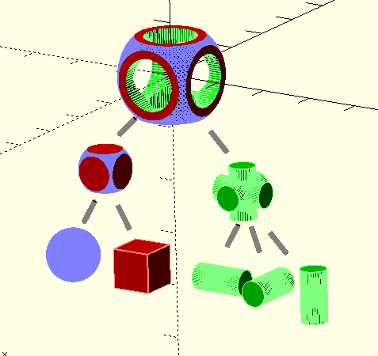
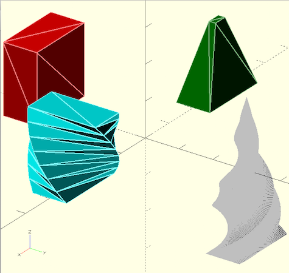

# Digital fabrication

2017 3D講義スライド

松浦知也

---

## 今回の最終目標

- 2Dの時:イラレなどでは作りにくい図形をプログラミングで作る
- 今回:**普通の3Dモデリングでは作りにくい3Dオブジェクトを作る**

---

## 3Dのデータ構造

|データの種類|内容|
|---|----|
|ポイントクラウド|点の集まり|
|ワイヤーフレーム|ポイントクラウド+頂点同士のつながり|
|サーフェス|ワイヤーフレーム+どこに面が張られているか|
|ソリッド|サーフェース+どこの面で閉じた空間が充填されているか|

- 最終的に体積を持っていないと3Dプリンタなどで出力できない

---

## 3D+プログラミング

- これらのデータを直に扱うのも不可能ではないが、大変
- そこでProcessingの時と同様、**単純な3Dオブジェクトを組み合わせる**
- 加えて3Dでは、**単純な2D図形を押し出して3Dにする**事もできる

---

---

---

## 例

